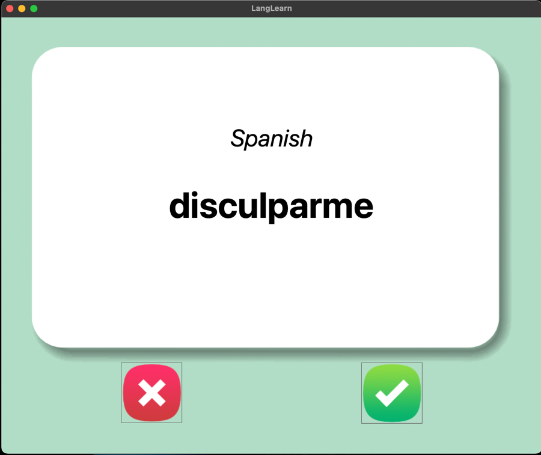
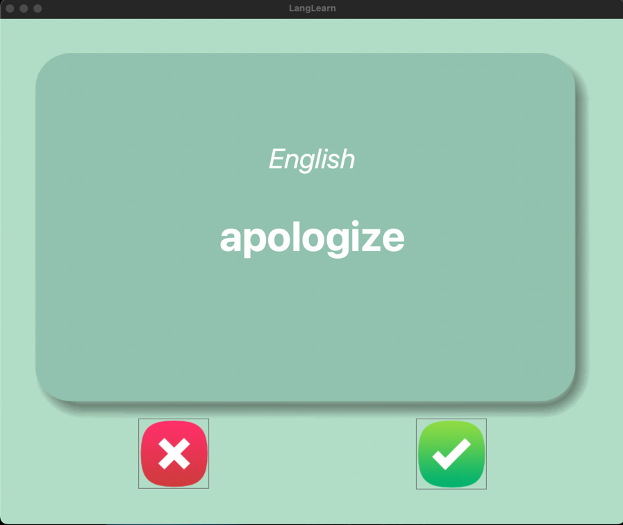

# LangLearn
This project displays flashcards as a study tool for learning some Spanish vocabulary words!




## Installation
1. Create a directory on your machine to house it. "LANGLEARN" could be a good choice!
```commandline
mkdir LANGLEARN
```
2. Look above and select "Code"
3. From here, copy HTTPS web URL
4. Return to your terminal and clone the repo.
```commandline
git clone https://github.com/LanoCodes/LangLearn.git
```
5. Using your favorite IDE, open the LANGLEARN folder.
6. Navigate to main and run the program from there. You will need the tkinter, os.path, and pandas packages installed.

## Usage
- When running the program a window will appear. From there a countdown will immediately start, giving you 4 seconds before the word's english translation is shown.
- After the time is up, you then decide whether you understood that word enough to remove it from the set of cards.
- If so, pressing the green check mark will generate a new card for you and remove the word from coming up again while resetting the timer.
- Pressing the red X will give you a random card from the words that are still left!
- You can "reset" this by removing the file that's created upon hitting the green check mark, and rerunning the program ("words_to_learn.csv" in your project directory)